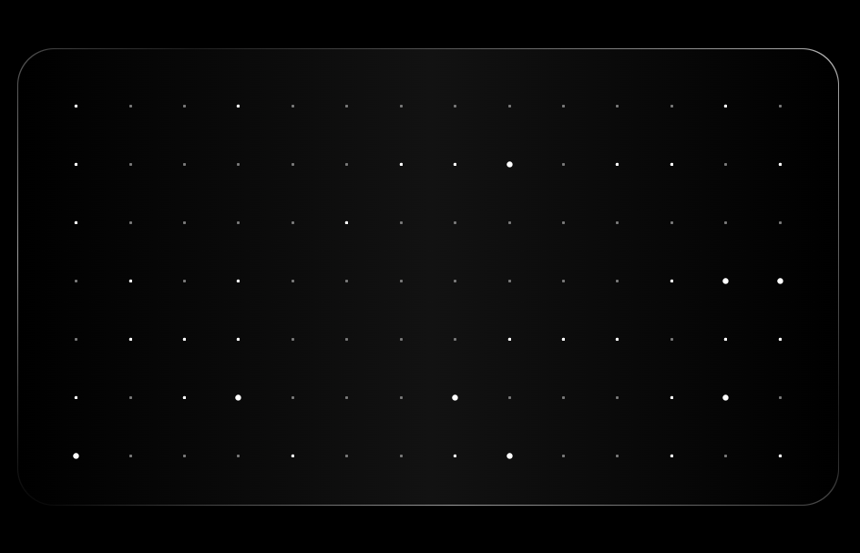

# StarGrid Component

## Description

The `StarGrid` component is a React component that displays a grid of items. Each item contains a circle and an expander element. The expander elements randomly change their size over time, creating a dynamic visual effect. The component utilizes CSS animations and React hooks to achieve this behavior.

